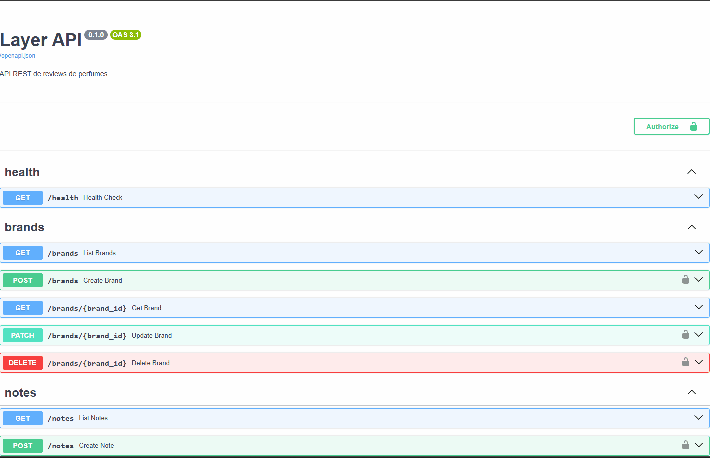
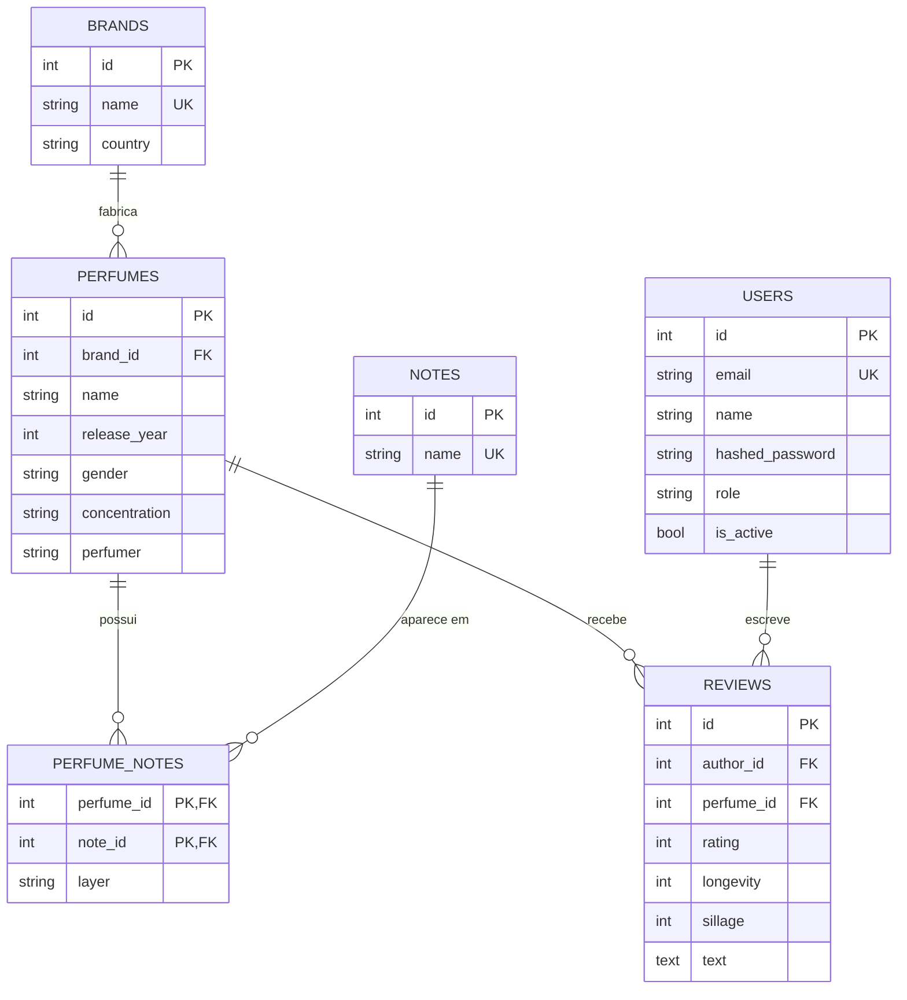

# Layer API

[](https://github.com/tassohenrique/layer-api/actions/workflows/ci.yml)


API REST de reviews de perfumes, inspirada no Fragrantica. Usuários consultam um catálogo de marcas, perfumes e notas olfativas organizadas por camada, e avaliam os perfumes com nota, fixação e projeção.

**🚀 API no ar:** [layer-api.onrender.com](https://layer-api.onrender.com)

> A hospedagem é gratuita e entra em repouso sem uso. A primeira requisição pode levar cerca de um minuto; depois disso, responde normalmente.



## Funcionalidades

- **Catálogo:** marcas, notas olfativas e perfumes, com as notas de cada perfume organizadas em topo, coração e fundo
- **Busca e ordenação:** paginação, filtro por marca e ranking dos perfumes mais bem avaliados
- **Autenticação:** cadastro e login com JWT, senhas armazenadas com hash Argon2
- **Permissões:** leitura pública, cadastro do catálogo restrito a administradores
- **Reviews:** cada usuário avalia cada perfume uma vez; só o autor edita a própria review, e o administrador pode moderar
- **Média das avaliações** e quantidade de reviews calculadas pelo banco, sem consultas extras

## Tecnologias

- **Python 3.14** e **FastAPI**
- **PostgreSQL 17**, **SQLAlchemy 2.0** e **Alembic** (migrations)
- **Pydantic** (validação), **PyJWT** e **pwdlib/Argon2** (autenticação)
- **pytest** e **pytest-cov** (94+ testes, 99% de cobertura)
- **Ruff** (lint e formatação)
- **Docker** e **Docker Compose**
- **GitHub Actions** (CI: lint, migrations e testes a cada push)
- **Render** (API em container) e **Neon** (PostgreSQL gerenciado)

## Modelo de dados



## Rotas

| Método | Rota | Acesso | Descrição |
|---|---|---|---|
| POST | `/auth/register` | Público | Cria uma conta |
| POST | `/auth/login` | Público | Login, devolve um token JWT |
| GET | `/auth/me` | Logado | Dados do usuário atual |
| GET | `/brands`, `/notes`, `/perfumes` | Público | Listagens com paginação |
| GET | `/perfumes?brand_id=1&sort=rating` | Público | Filtro por marca e ranking por avaliação |
| POST, PATCH, DELETE | `/brands`, `/notes`, `/perfumes` | Admin | Gerenciamento do catálogo |
| GET | `/perfumes/{id}/reviews` | Público | Reviews de um perfume |
| POST | `/perfumes/{id}/reviews` | Logado | Avalia um perfume |
| PATCH | `/reviews/{id}` | Autor | Edita a própria review |
| DELETE | `/reviews/{id}` | Autor ou admin | Apaga uma review |

A documentação completa e interativa fica em [`/docs`](https://layer-api.onrender.com/docs).

## Decisões técnicas

**Arquitetura em camadas.** Cada recurso é dividido em router (HTTP), service (regras de negócio) e repository (acesso ao banco). Os services não conhecem HTTP: lançam exceções da aplicação, que um único handler converte nos códigos certos (404, 409, 401, 403).

**Schemas separados dos models.** Os schemas Pydantic de saída não têm campo de senha, então o hash nunca pode vazar numa resposta. As reviews mostram só o nome do autor, sem o e-mail.

**Segurança na autenticação.** Login com e-mail inexistente e com senha errada devolvem a mesma resposta, para não revelar quais e-mails têm conta. A cada requisição, o usuário do token é buscado no banco, então uma conta desativada perde o acesso na hora. O autor de uma review vem sempre do token, nunca do corpo da requisição.

**Regras protegidas também no banco.** Nomes únicos, uma review por usuário por perfume e as faixas das notas (1 a 10) são garantidos por constraints no PostgreSQL, além da validação na API.

**Performance.** Listagens usam eager loading (`selectinload`) para evitar o problema N+1, e a média das avaliações é calculada pelo banco com uma subconsulta correlacionada, sem trazer as reviews para a memória.

**Notas por camada.** A relação entre perfumes e notas é um muitos-para-muitos com atributo extra (a camada), modelado como association object com chave primária composta, impedindo a mesma nota duas vezes no mesmo perfume.

## Como rodar localmente
Pré-requisito: Docker.

Para popular o banco com um catálogo de exemplo (marcas, perfumes, notas e reviews):

```bash
docker compose exec api python -m scripts.seed --with-reviews
```

```bash
git clone https://github.com/tassohenrique/layer-api.git
cd layer-api
cp .env.example .env    # gere uma JWT_SECRET_KEY e ajuste as senhas
docker compose up -d --build
```

A API sobe em http://localhost:8000, já com as migrations aplicadas. Para criar um administrador:

```bash
docker compose exec api python -m scripts.create_admin --email admin@exemplo.com --name "Admin"
```

### Desenvolvimento sem Docker para a API

```bash
docker compose up -d db
python -m venv .venv
.venv\Scripts\activate          # Windows
pip install -r requirements-dev.txt
alembic upgrade head
fastapi dev app/main.py
```

## Testes

Os testes usam um banco separado. Crie ele uma única vez:

```bash
docker compose exec db createdb -U layer layer_test
```

Depois:

```bash
python -m pytest -v
python -m pytest --cov=app --cov-report=term-missing   # com cobertura
```

A cada push na branch `main`, o GitHub Actions roda o lint, aplica as migrations num banco limpo e executa todos os testes. O deploy no Render acontece depois que o CI passa.

## Autor

**Tasso Rodrigues** · [LinkedIn](https://www.linkedin.com/in/tassorodrigues/) · [GitHub](https://github.com/tassohenrique)